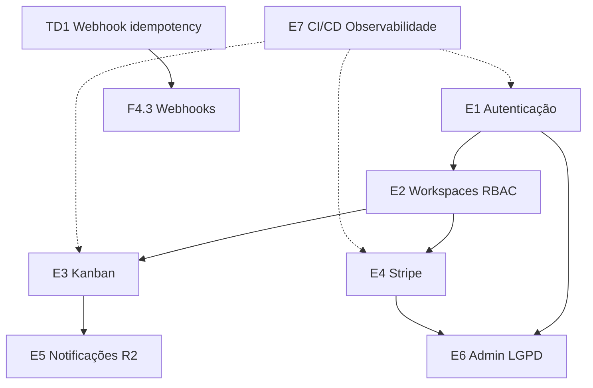

# Saída esperada — TaskFlow SaaS

Documento gerado pelo skill `project-manager` a partir de [sample-prd.md](sample-prd.md).

Demonstra o output completo de `/project-manager analyze-prd` + `/project-manager create-backlog`.

---

# Parte 1 — Análise de PRD

## Resumo executivo

TaskFlow é um SaaS B2B de gestão de tarefas com modelo freemium (Free 3 assentos / Pro R$ 29/assento). O MVP exige autenticação JWT, workspaces multi-usuário com RBAC, boards Kanban, integração Stripe completa e e-mails transacionais. Release alvo MVP em ~3 meses com alpha interno em jul/2026. Riscos principais: webhooks Stripe sem idempotency, compliance LGPD em delete account, e race condition no Kanban.

## Personas e stakeholders

| Persona | Papel | Necessidade principal |
|---------|-------|----------------------|
| Ana (P1) | Tech Lead / decisor | Visibilidade de sprint, preço por assento |
| Bruno (P2) | Developer | Atualização rápida, notificações relevantes |
| Carla (P3) | Owner workspace | Convites, billing, export |

## MoSCoW consolidado

- **Must (R1):** Auth, workspace, Kanban, Stripe, e-mail transacional, admin básico
- **Should (R2):** In-app notifications, audit log, CSV reports, OAuth Google
- **Could:** API REST, Slack, mobile
- **Won't v1:** Gantt, time tracking, white-label

## Módulos SaaS detectados

| Módulo | Evidência | Cobertura | Gap |
|--------|-----------|-----------|-----|
| Authentication | RF-01 | Completa | MFA adiado R2 |
| Authorization | RF-02.3 roles | Completa | — |
| User Management | RF-02 | Completa | — |
| Subscription Management | RF-04 | Completa | — |
| Billing | RF-04, RF-06.2 | Parcial | Histórico faturas via Stripe link |
| Payments / Stripe | RF-04, integrações | Completa | Idempotency ausente (dívida) |
| Notifications | RF-05 | Parcial MVP | In-app apenas R2 |
| Audit Logs | RF R2 | Ausente MVP | R2 |
| Administration | RF-06 | Completa MVP | — |
| Analytics | Métricas PRD | Parcial | Dashboard básico admin |
| Reports | RF R2 CSV | Ausente MVP | R2 |
| API Layer | Could have | Ausente | Backlog |
| Security | RNF-03/04 | Parcial | Delete account detalhar |
| Monitoring | RNF-06, Sentry | Parcial | Alertas a definir |
| Infrastructure | Vercel, Neon | Completa | — |
| CI/CD | RNF-07 | Completa | — |

## Épicos candidatos

| ID | Título | Objetivo de negócio | Prioridade | Dependências |
|----|--------|---------------------|------------|--------------|
| E1 | Autenticação e gestão de sessão | Usuários acessam conta com segurança | P0 | — |
| E2 | Workspaces, equipes e autorização | Equipes colaboram com roles claros | P0 | E1 |
| E3 | Projetos, tarefas e board Kanban | Equipes gerenciam trabalho visualmente | P0 | E2 |
| E4 | Assinaturas, billing e Stripe | Monetização via planos Free/Pro | P0 | E2 |
| E5 | Notificações e comunicação | Usuários informados no momento certo | P1 | E2, E3 |
| E6 | Administração e conformidade | Owners gerenciam workspace e LGPD | P1 | E1, E4 |
| E7 | Observabilidade, qualidade e CI/CD | Produção estável e deploy confiável | P0 | Transversal |

## Árvore preliminar Epic → Feature

```
E1 — Autenticação
├── F1.1 Cadastro e-mail/senha
├── F1.2 Login, logout e refresh token
└── F1.3 Recuperação de senha

E2 — Workspaces e RBAC
├── F2.1 Criação workspace onboarding
├── F2.2 Convite membros por e-mail
└── F2.3 Gestão roles Owner/Admin/Member

E3 — Kanban
├── F3.1 CRUD projetos
├── F3.2 CRUD tarefas
└── F3.3 Board drag-and-drop

E4 — Stripe
├── F4.1 Planos Free/Pro e trial
├── F4.2 Checkout e portal Stripe
├── F4.3 Webhooks subscription
└── F4.4 Enforcement limite Free

E5 — Notificações (R2)
├── F5.1 E-mail tarefa atribuída
├── F5.2 Centro in-app
└── F5.3 Preferências

E6 — Admin e LGPD
├── F6.1 Painel admin membros
├── F6.2 Export dados usuário
└── F6.3 Delete account

E7 — Plataforma
├── F7.1 Pipeline CI/CD
├── F7.2 Sentry e logging
└── F7.3 Testes E2E core flows
```

## Estimativa macro

| Épico | Features | Points | Sprints |
|-------|----------|--------|---------|
| E1 | 3 | 13 | 1 |
| E2 | 3 | 13 | 1 |
| E3 | 3 | 16 | 1–2 |
| E4 | 4 | 21 | 2 |
| E7 | 3 | 8 | 1 |
| **MVP (E1–E4, E7)** | **16** | **~71** | **~4–5** |

## Perguntas em aberto (com defaults)

| # | Pergunta | Default assumido |
|---|----------|------------------|
| Q1 | MFA Admin MVP? | Não — R2 |
| Q2 | Multi-currency? | BRL only |
| Q3 | Retenção audit log? | 90 dias (R2) |

---

# Parte 2 — Backlog (amostra detalhada)

Abaixo, work items representativos totalmente preenchidos. O backlog completo conteria ~45 tasks adicionais seguindo o mesmo padrão.

---

## Epic E1 — Autenticação e gestão de sessão

<!-- project-manager: type=epic | points=13 | priority=high -->

### Objetivo de Negócio

Permitir que usuários criem conta, autentiquem-se com segurança e recuperem acesso, habilitando todo o restante do produto.

### Descrição

Implementar fluxo completo de autenticação e-mail/senha com JWT (access + refresh), validações de senha, logout com invalidação de token e recuperação de senha via SendGrid. Escopo MVP exclui OAuth e MFA.

### Valor para o Usuário

Bruno e Carla acessam TaskFlow de forma segura, com sessão persistente entre dias de trabalho e recuperação simples se esquecerem a senha.

### Métricas de Sucesso

| Métrica | Baseline | Meta | Prazo |
|---------|----------|------|-------|
| Taxa conclusão cadastro | 0 | ≥ 85% | 30 dias pós-R0 |
| Tempo médio login | — | < 2s p95 | Release R0 |
| Tickets suporte reset senha | — | < 5% dos tickets auth | 60 dias |

### Dependências

- **Externas:** SendGrid configurado, domínio verificado
- **Blocked by:** Nenhuma
- **Blocks:** E2, E4, E6

### Riscos

| Risco | Prob. | Impacto | Mitigação |
|-------|-------|---------|-----------|
| Token theft via XSS | Média | Alto | HttpOnly cookies + CSP |
| Rate limit brute force | Média | Médio | Rate limit login 5/min/IP |

### Critérios de Aceite do Épico

- [ ] Usuário cadastra, confirma e faz login end-to-end em staging
- [ ] Refresh token rotaciona a cada uso
- [ ] Reset senha funciona com link expirando em 1h
- [ ] Logout invalida refresh token no servidor
- [ ] Testes automatizados cobrem fluxos auth críticos
- [ ] Sentry captura erros auth com correlation ID

### Estimativa

- **Story Points:** 13 | **Sprints:** 1 | **Complexidade:** M

---

## Feature F1.1 — Cadastro com e-mail e senha

<!-- project-manager: type=feature | epic=E1 | points=5 | complexity=M | priority=high -->

### Épico pai

**Autenticação e gestão de sessão** — E1

### Descrição

Formulário de cadastro com validação client e server, persistência em PostgreSQL via Drizzle, hash bcrypt da senha, e e-mail de boas-vindas SendGrid.

### User Story

Como **novo usuário**,
eu quero **criar uma conta com e-mail e senha**,
para que **eu possa acessar TaskFlow e criar meu workspace**.

### Critérios de Aceite

- [ ] **Dado** e-mail válido não cadastrado, **quando** submeter senha válida (8+ chars, 1 número, 1 especial), **então** conta é criada e usuário redirecionado ao onboarding
- [ ] **Dado** e-mail já cadastrado, **quando** submeter cadastro, **então** exibe erro "E-mail já em uso" sem revelar se e-mail existe em outros casos
- [ ] **Dado** senha fraca, **quando** submeter, **então** exibe requisitos inline
- [ ] E-mail boas-vindas enviado em pt-BR em < 30s
- [ ] Senha nunca persistida em plain text; bcrypt cost ≥ 12
- [ ] Testes unitários service + integração API POST /auth/register

### Dependências

- **Blocked by:** Nenhuma
- **Blocks:** F2.1 (onboarding)

### Complexidade estimada

| Story Points | 5 | Complexidade | M | Horas | 20–28h |

### Tasks

| ID | Task | Complexidade |
|----|------|--------------|
| T1.1.1 | Migration tabela users | S |
| T1.1.2 | API POST /auth/register + validação Zod | M |
| T1.1.3 | UI página cadastro + validação formulário | M |
| T1.1.4 | Integração SendGrid e-mail boas-vindas pt-BR | S |
| T1.1.5 | Testes unitários e integração auth register | S |

---

## Task T1.1.2 — API POST /auth/register com validação

<!-- project-manager: type=task | feature=F1.1 | epic=E1 | complexity=M | priority=high -->

### Descrição

Implementar endpoint tRPC/REST de registro com validação de input, hash de senha e retorno de tokens JWT.

### Detalhes técnicos

- Route: `auth.register` (tRPC) ou `POST /api/auth/register`
- Validação Zod: email, password (regex requisitos PRD)
- Drizzle insert em `users` com `email`, `passwordHash`, `createdAt`
- Retorno: `{ accessToken, refreshToken, user: { id, email } }`
- Rate limit: 10 req/min por IP

### Requisitos de teste

- [ ] Registro válido retorna 201 + tokens
- [ ] E-mail duplicado retorna 409
- [ ] Senha inválida retorna 400 com detalhes
- [ ] Mock SendGrid não bloqueia response

### Estimativa

Complexidade **M** — 6h

### Critérios de aceite

- [ ] Endpoint deployado em preview env
- [ ] OpenAPI/tRPC router documentado
- [ ] CI verde

---

## Bug B1 — Race condition no drag-and-drop Kanban

<!-- project-manager: type=bug | severity=medium | priority=medium -->

### Severidade

**Medium** — funcionalidade degradada; workaround via segundo drag

### Passos para reproduzir

1. Login como Bruno em workspace com projeto ativo
2. Board Kanban com ≥ 5 tarefas na coluna "Em progresso"
3. Arrastar tarefa rapidamente para "Concluído"
4. Refresh imediato (F5)

### Comportamento esperado

Tarefa permanece em "Concluído" após refresh.

### Comportamento atual

Tarefa reverte para "Em progresso" em ~30% das tentativas rápidas.

### Investigação técnica

- Hipótese: optimistic UI update conflita com response lenta; último write wins
- Suspeitos: `components/kanban/TaskCard.tsx`, `api/tasks/updateStatus.ts`

### Critérios de aceite

- [ ] Drag rápido 20x consecutivas sem revert após refresh
- [ ] Teste E2E Playwright cobrindo cenário
- [ ] Debounce ou version column no update

### Estimativa

Complexidade **M** — 6h

---

## Bug B2 — Subject de convite em inglês

<!-- project-manager: type=bug | severity=low | priority=low -->

### Severidade

**Low** — funcionalidade ok; impacto UX/localização

### Passos para reproduzir

1. Carla convida membro via e-mail
2. Verificar subject na caixa de entrada

### Comportamento esperado

Subject: "Você foi convidado para o workspace [Nome] no TaskFlow"

### Comportamento atual

Subject: "You're invited to join..."

### Critérios de aceite

- [ ] Template SendGrid pt-BR para convite
- [ ] Subject e body em pt-BR
- [ ] Teste snapshot template

### Estimativa

Complexidade **XS** — 1h

---

## Dívida Técnica TD1 — Webhook Stripe sem idempotency

<!-- project-manager: type=technical-debt | priority=high -->

### Descrição

Handler de webhook Stripe processa eventos sem verificar `event.id` duplicado, podendo criar assinaturas duplicadas em retries.

### Risco

**Alto** — impacto financeiro e integridade billing

### Impacto

- Cobrança duplicada → churn e chargebacks
- Divergência estado DB vs Stripe

### Refatoração proposta

1. Criar tabela `stripe_events_processed (event_id PK, processed_at)`
2. Wrap handler em transaction: check → process → mark
3. Retornar 200 em duplicate (idempotent)
4. Testes com fixture `customer.subscription.created` duplicado

### Prioridade

**Alta** — antes de R1 beta

### Critérios de aceite

- [ ] Evento duplicado não altera subscription state
- [ ] Teste integração simula retry Stripe
- [ ] Métrica `stripe_webhook_duplicate_total` exposta

### Estimativa

Complexidade **M** — 8h | **Story Points:** 3

---

# Parte 3 — Backlog Summary

| Tipo | ID | Título | Points/Complexidade | Prioridade | Parent |
|------|-----|--------|---------------------|------------|--------|
| Epic | E1 | Autenticação e gestão de sessão | 13 | P0 | — |
| Epic | E2 | Workspaces, equipes e RBAC | 13 | P0 | — |
| Epic | E3 | Projetos e Kanban | 16 | P0 | E2 |
| Epic | E4 | Assinaturas e Stripe | 21 | P0 | E2 |
| Epic | E7 | Observabilidade e CI/CD | 8 | P0 | — |
| Feature | F1.1 | Cadastro e-mail/senha | 5 | P0 | E1 |
| Task | T1.1.2 | API POST /auth/register | M | P0 | F1.1 |
| Bug | B1 | Race condition Kanban DnD | M | P1 | F3.3 |
| Bug | B2 | Subject convite inglês | XS | P2 | F2.2 |
| Tech Debt | TD1 | Webhook idempotency | 3 | P0 | E4 |

**MVP total:** ~71 story points ≈ 4–5 sprints (2 devs)

---

# Parte 4 — Grafo de dependências



---

# Parte 5 — Release Plan (resumo)

| Release | Data alvo | Escopo | Points |
|---------|-----------|--------|--------|
| R0 Alpha | 15/07/2026 | E1, E2, E7 | 34 |
| R1 MVP Beta | 01/09/2026 | E3, E4, TD1, bugs P0/P1 | 37 |
| R2 GA | 15/10/2026 | E5, E6, OAuth, reports | 40+ |

---

# Parte 6 — Sprint 1 (exemplo)

**Sprint Goal:** Usuários criam conta, fazem login e recuperam senha em staging.

**Capacidade:** 36 pts (2 devs, 2 semanas, foco 75%)

| Issue | Título | Points |
|-------|--------|--------|
| F1.1 | Cadastro e-mail/senha | 5 |
| F1.2 | Login, logout, refresh | 5 |
| F1.3 | Recuperação de senha | 3 |
| F7.1 | Pipeline CI/CD | 3 |
| TD1 | Webhook idempotency (spike + fix) | 3 |

**Total commitment:** 19 pts (+ buffer bugs)

---

# Parte 7 — Labels sugeridas por item

| Item | Labels |
|------|--------|
| E1 | `epic`, `high-priority`, `ready`, `auth` |
| F1.1 | `feature`, `high-priority`, `ready`, `auth` |
| T1.1.2 | `task`, `high-priority`, `ready`, `auth` |
| B1 | `bug`, `medium-priority`, `ready` |
| B2 | `bug`, `low-priority`, `ready` |
| TD1 | `technical-debt`, `high-priority`, `ready`, `billing` |

---

Este documento serve como referência de qualidade e formato. Ao processar PRDs reais, o agente deve gerar **todos** os épicos, features e tasks com o mesmo nível de detalhe — não apenas amostras.
