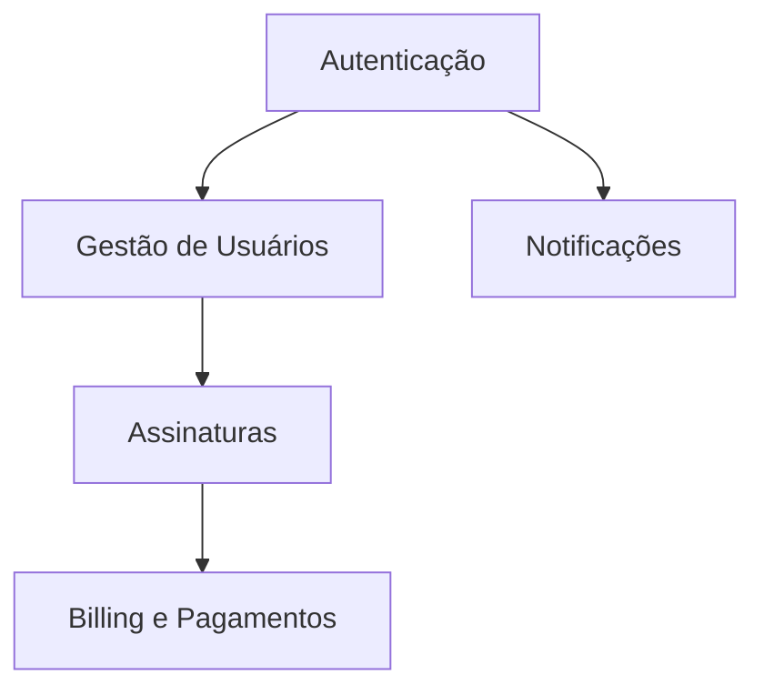

# Workflow: analyze-prd

Comando: `/project-manager analyze-prd`

## Objetivo

Extrair de um PRD, feature request ou descrição de projeto uma análise estruturada que alimente a geração do backlog, sem ainda criar issues no GitHub (salvo se o usuário pedir em sequência).

## Entradas

- PRD ou documento de requisitos (texto, arquivo `.md`, link, PDF convertido)
- Contexto opcional: repositório, stack, constraints, prazo, equipe

## Saídas

Documento de análise com as seções abaixo, em **português (pt-BR)**.

---

## Passo a passo

### 1. Ler e normalizar o documento

- Identificar visão, objetivos, personas, requisitos funcionais e não-funcionais
- Separar **must have**, **should have**, **could have**, **won't have** (MoSCoW)
- Listar integrações externas mencionadas (Stripe, SendGrid, OAuth providers, etc.)
- Extrair requisitos de performance, segurança, compliance (LGPD, SOC2, etc.)

### 2. Detectar módulos SaaS

Percorrer o texto e marcar módulos da tabela em `SKILL.md` (Authentication, Billing, etc.).

Para cada módulo detectado, registrar:

| Módulo | Evidência no PRD | Cobertura | Gap identificado |
|--------|------------------|-----------|------------------|
| [Nome] | [Trecho ou RF-XX] | [Completo/Parcial/Ausente] | [O que falta definir] |

### 3. Identificar épicos candidatos

Agrupar requisitos em épicos coesos (1 épico = 1–3 sprints de valor de negócio).

Regras:

- Um épico responde a **um objetivo de negócio** claro
- Evitar épicos horizontais puramente técnicos ("Melhorar qualidade") — preferir valor + técnica explícita
- Nomear épicos como outcomes: "Usuários conseguem assinar planos pagos" vs "Implementar Stripe"

Entregar tabela:

| ID | Título provisório do Épico | Objetivo de negócio | Módulos | Prioridade | Dependências |
|----|---------------------------|---------------------|---------|------------|--------------|
| E1 | [...] | [...] | [...] | P0/P1/P2 | [E2, externo] |

### 4. Mapear features preliminares

Por épico, listar 2–7 features candidatas (títulos apenas, sem detalhar ainda):

```
E1 — [Título do Épico]
  ├── F1.1 — [Feature]
  ├── F1.2 — [Feature]
  └── F1.3 — [Feature]
```

Validar INVEST: se uma feature parece > 1 sprint, anotar "candidata a split".

### 5. Identificar bugs conhecidos

Fontes: seção de bugs no PRD, feedback de QA, incidentes mencionados, regressões conhecidas.

Se o PRD não menciona bugs, registrar: "Nenhum bug explícito no documento — bugs serão gerados na fase de QA ou a partir do codebase."

### 6. Identificar riscos

| ID | Risco | Categoria | Prob. | Impacto | Mitigação sugerida | Owner |
|----|-------|-----------|-------|---------|-------------------|-------|
| R1 | [...] | [Técnico/Negócio/Legal] | [...] | [...] | [...] | [PO/Tech Lead] |

Categorias comuns em SaaS:

- Integração de pagamento atrasada bloqueia monetização
- LGPD: consentimento e exportação de dados não especificados
- Multi-tenancy não mencionada mas implícita
- Escalabilidade não definida para pico de uso

### 7. Identificar dívida técnica preliminar

A partir de menções a "legado", "MVP", "refatorar", stack antiga, ou gaps arquiteturais inferidos:

| Item | Descrição resumida | Urgência | Relacionado a |
|------|-------------------|----------|---------------|
| TD1 | [...] | [Alta/Média/Baixa] | [Epic E2] |

### 8. Dependências externas e sequenciamento

Produzir grafo textual ou mermaid:



Indicar **caminho crítico** para MVP.

### 9. Perguntas em aberto

Listar ambiguidades que impedem estimativa confiável. Formato:

| # | Pergunta | Impacto se não respondida | Sugestão de default |
|---|----------|---------------------------|---------------------|
| Q1 | [...] | [Alto] | [Assumir X para continuar] |

**Regra:** se houver perguntas P0 sem resposta, gerar backlog assumindo defaults documentados e marcar items afetados com label `blocked` ou nota "⚠️ depende de Q1".

### 10. Estimativa macro

| Épico | Features (qtd) | Points estimados | Sprints |
|-------|----------------|------------------|---------|
| E1 | 4 | 21 | 2 |

**Total MVP:** [X story points] ≈ [Y sprints] com equipe de [Z devs].

### 11. Formato de entrega

Entregar análise completa:

```markdown
# Análise de PRD — [Nome do Projeto]

## Resumo executivo
[3–5 frases]

## Personas e stakeholders
[...]

## MoSCoW
[...]

## Módulos SaaS detectados
[...]

## Épicos candidatos
[...]

## Árvore Epic → Feature (preliminar)
[...]

## Riscos
[...]

## Dívida técnica preliminar
[...]

## Grafo de dependências
[mermaid]

## Perguntas em aberto
[...]

## Estimativa macro
[...]

## Próximos passos recomendados
1. `/project-manager create-backlog` — gerar backlog completo
2. Responder perguntas Q1–Qn
3. `/project-manager create-github-issues` — publicar no GitHub
```

---

## Checklist de qualidade

- [ ] Todos os requisitos must-have mapeados a um épico
- [ ] Nenhum épico monolítico > 3 sprints sem justificativa
- [ ] Módulos SaaS transversais (Security, Monitoring, CI/CD) considerados
- [ ] Riscos de compliance (LGPD) avaliados para produto BR
- [ ] Perguntas em aberto priorizadas por impacto
- [ ] Conteúdo 100% em pt-BR
