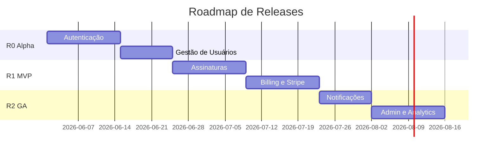

# Workflow: release-planning

Comando: `/project-manager release-planning`

## Objetivo

Agrupar épicos e features em releases/milestones coerentes, definir sequenciamento, critérios de go-live e plano de rollout para produto SaaS.

---

## Entradas

- Backlog completo com estimativas
- Roadmap desejado (datas, eventos de negócio, contratos)
- Ambientes disponíveis (dev, staging, production)
- Política de release (continuous deploy vs release train)

---

## Passo 1 — Definir estratégia de release

| Estratégia | Quando usar | Cadência |
|------------|-------------|----------|
| MVP first | Validar product-market fit | 1 release inicial mínima |
| Release train | SaaS maduro, equipe > 5 | Quinzenal ou mensal |
| Continuous | Feature flags maduras | Deploy diário, release notes semanais |

Confirmar com usuário ou inferir do PRD.

---

## Passo 2 — Identificar releases

Padrão recomendado para SaaS greenfield:

| Release | Nome | Objetivo | Épicos incluídos |
|---------|------|----------|------------------|
| R0 | Internal Alpha | Dogfooding interno | Auth, User Management |
| R1 | MVP / Beta fechado | Primeiros usuários pagantes | Subscription, Billing, Payments |
| R2 | GA v1.0 | Lançamento público | Notifications, Admin, Analytics |
| R3 | v1.1+ | Otimização e escala | Reports, API pública, integrações |

Ajustar conforme PRD.

---

## Passo 3 — Sequenciamento por dependências

Construir roadmap mermaid:



Validar:

- Billing nunca antes de Auth
- Webhooks Stripe após model de subscription
- Admin após core flows estáveis

---

## Passo 4 — Critérios de go-live por release

### Template por release

```markdown
## Release [Rx] — [Nome]

### Escopo
- Epic #101 — Autenticação
- Epic #105 — ...

### Fora do escopo
- OAuth social (v1.1)
- Relatórios avançados

### Critérios de go-live
- [ ] Todos P0 bugs resolvidos
- [ ] Testes E2E passando em staging
- [ ] Load test: [N] req/s p95 < [X]ms
- [ ] Runbook de incidentes documentado
- [ ] Rollback testado (< 15 min)
- [ ] LGPD: política de privacidade publicada (se dados pessoais)
- [ ] Monitoramento: alertas configurados para [fluxos críticos]
- [ ] Backup e restore testados (se aplicável)

### Feature flags
| Flag | Default prod | Notas |
|------|--------------|-------|
| `billing_enabled` | off → on no launch | Kill switch |

### Rollout plan
1. Deploy staging — smoke test
2. Canary 5% prod — 24h monitoramento
3. 50% prod — 48h
4. 100% prod

### Comunicação
- Release notes (usuários)
- Changelog interno
- Suporte: FAQ atualizado

### Rollback triggers
- Error rate > X%
- Payment failure rate > Y%
- P0 bug em produção
```

---

## Passo 5 — Mapear issues → milestones GitHub

| Milestone | Data alvo | Issues (Epics/Features) | Story Points |
|-----------|-----------|-------------------------|--------------|
| `r0-alpha` | [data] | #101–#115 | 34 |
| `r1-mvp` | [data] | #116–#145 | 55 |
| `r2-ga-v1` | [data] | #146–#180 | 68 |

Criar milestones via MCP ou:

```bash
gh api repos/owner/repo/milestones -f title="r1-mvp" -f due_on="2026-08-15T00:00:00Z"
```

Associar issues às milestones na criação ou batch update.

---

## Passo 6 — Riscos de release

| Release | Risco | Impacto | Mitigação |
|---------|-------|---------|-----------|
| R1 MVP | Stripe webhook failures | Sem receita | Idempotency + dead letter queue |
| R2 GA | Pico de tráfego no launch | Downtime | Auto-scaling + load test |
| R2 GA | LGPD complaint | Legal | DPO review + export/delete user |

---

## Passo 7 — Dívida técnica e hardening

Por release, reservar **10–15%** da capacidade para:

- Security hardening
- Performance
- Observabilidade
- Tech debt P0

Incluir no plano explicitamente (não absorver silenciosamente).

---

## Passo 8 — Release notes template

Gerar preview por release:

```markdown
# Release Notes — [Rx Nome] ([versão])

## Novidades
- **[Feature]** — [Benefício para usuário em linguagem simples]
- **[Feature]** — [...]

## Melhorias
- [...]

## Correções
- [...]

## Breaking changes
- Nenhuma / [descrever + migration guide]

## Ações necessárias (admin/dev)
- [Ex.: configurar webhook URL no Stripe dashboard]

## Known issues
- [#201] — [workaround]
```

---

## Passo 9 — Documento final de release plan

Entregar:

```markdown
# Release Plan — [Projeto]

## Visão geral

| Release | Data alvo | Goal | Points | Sprints |
|---------|-----------|------|--------|---------|
| R0 | [data] | Alpha interno | 34 | 2 |
| R1 | [data] | MVP beta | 55 | 3 |
| R2 | [data] | GA v1.0 | 68 | 4 |

## Roadmap (diagrama)
[mermaid gantt ou graph]

## Detalhamento por release
[Seções do Passo 4 para cada Rx]

## Milestones GitHub
[Tabela do Passo 5]

## Caminho crítico
[Lista ordenada de epics/features blocker]

## Dependências externas
| Dependência | Release | Responsável | Deadline |
|-------------|---------|-------------|----------|
| Conta Stripe prod | R1 | PO | [data] |
| Domínio + SSL | R0 | DevOps | [data] |

## Métricas de sucesso pós-release
| Release | Métrica | Meta 30 dias |
|---------|---------|--------------|
| R1 MVP | Conversão trial | ≥ 5% |
| R2 GA | NPS | ≥ 40 |

## Próximos passos
1. Criar milestones no GitHub
2. Associar issues
3. `/project-manager sprint-planning` para Sprint 1 do R0
```

---

## Integração com sprint planning

Cada release decompõe em N sprints:

```
R1 MVP (55 pts) ≈ 3 sprints × 20 pts
  Sprint 3: Subscription UI + API
  Sprint 4: Stripe checkout
  Sprint 5: Webhooks + billing hardening
```

Cross-reference sprint docs com release milestones.

---

## Checklist

- [ ] Releases ordenadas por dependências técnicas
- [ ] MVP claramente delimitado (MoSCoW won't have explícito)
- [ ] Go-live criteria mensuráveis por release
- [ ] Rollout e rollback definidos
- [ ] LGPD/security considerados para SaaS BR
- [ ] Milestones mapeadas a issues
- [ ] Documento completo em pt-BR
- [ ] GitHub atualizado quando MCP/cli disponível
